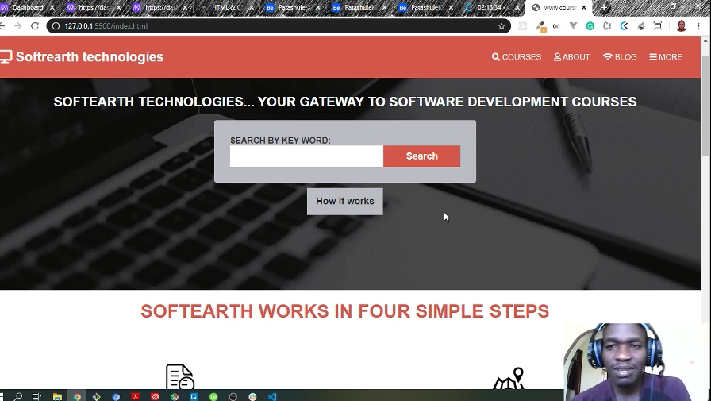
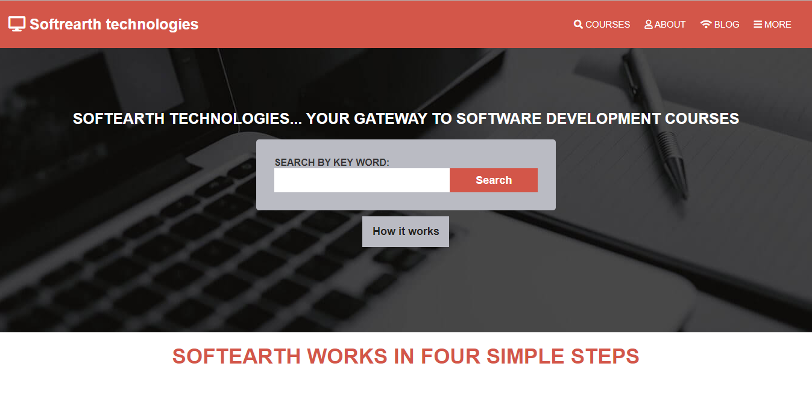
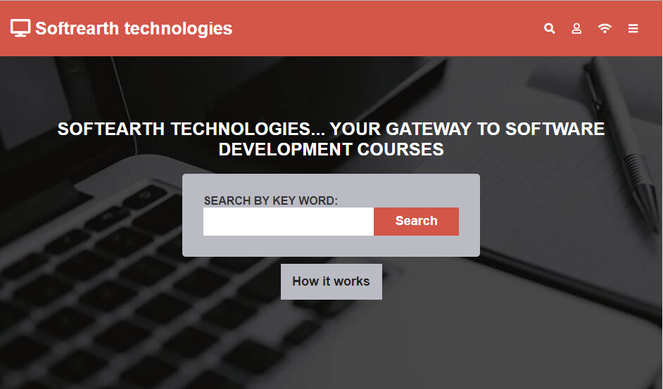

# courses-guide project
This project is the user interface or the front-end of a course guide application. With this application, users can search for various software development courses and purchase them. This application is built for all devices i.e mobiles, laptops, and tabs.

> This website is designed to allow users access various programming courses online. Some of the courses can actuall be delivered to users at the premises of the company. These are mainly programming based courses like JavaScript, Ruby, Java and many others. A user selects a suitable course and applies for that particular course. The courses are available for a certain duration.

# Project Presentation Video

## Home Page
# Desktop View

# Tablet View

# Mobile View

## Built With

- HTML
- CSS
- Flexbox
- Gid system

## Live Demo

[Live Demo Link](https://raw.githack.com/OdongAlican/courses-guide/develop/)

### Prerequisites

#### You should have installed git on your local machine and a text editor preferably VS Code.

### Setup

#### Clone the repository into your local machine.

## Author

👤 **Author**

- Github: [@OdongAlican](https://github.com/OdongAlican)
- Twitter: [@odongsandie](https://twitter.com/odongsandie)
- Linkedin: [Sunday Alican odong](https://www.linkedin.com/in/sunday-alican-odong-b99226b7)

## 🤝 Contributing

Contributions, issues and feature requests are welcome.

Feel free to check the [issues page](https://github.com/OdongAlican/courses-guide/issues).

## Credits

Thanks to [Mathew Njuguna and others on Behance](https://www.behance.net/mathewnjuguna) for her awesome design work. I based my work on  [this](https://www.behance.net/gallery/25563385/PatashuleKE) design.

## Show your support

Give a ⭐️ if you like this project!

## License

This project is [MIT](lic.url) licensed.

